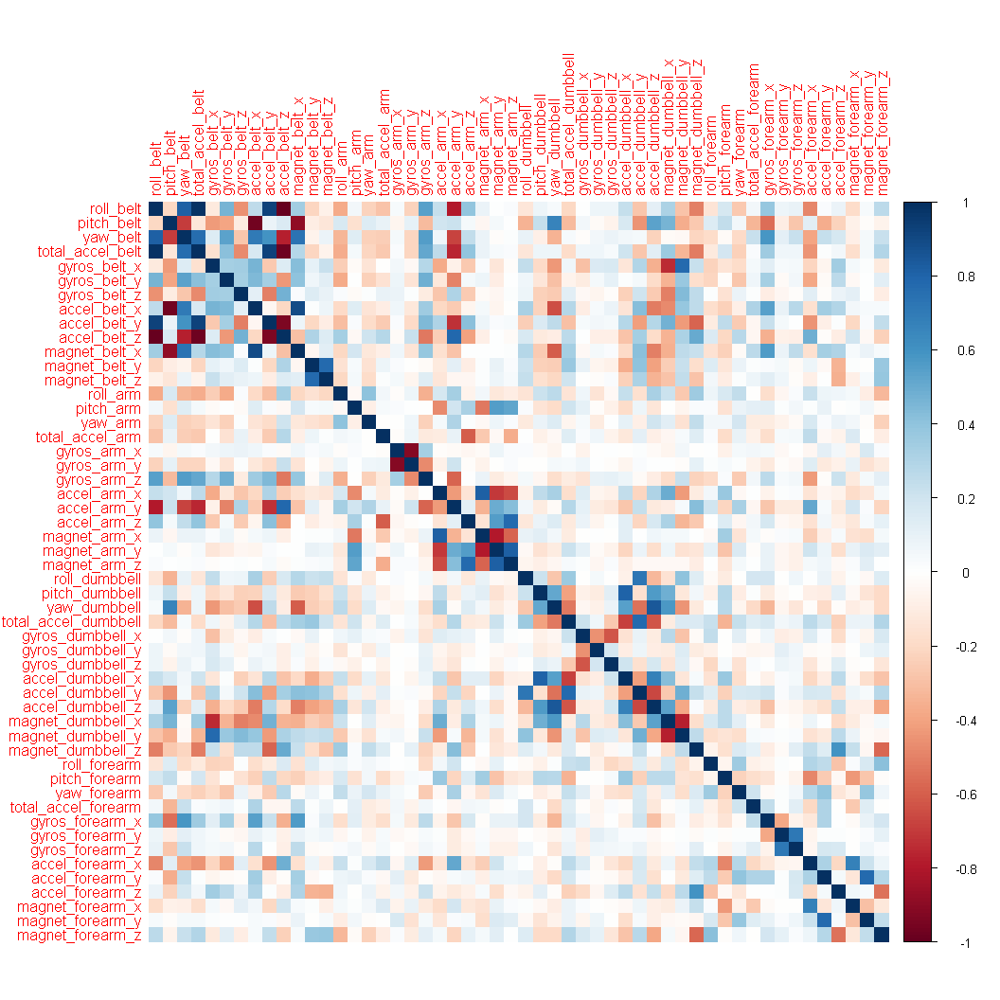
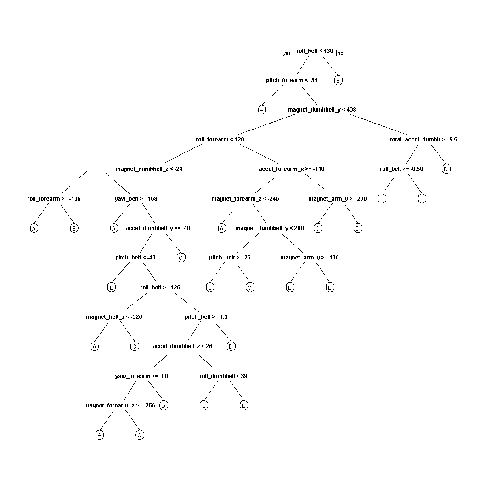

# Practical Machine Learning Project - Quantified Self Movement Data Analysis Report
Khoo Jia Jun  

## Introduction  
Using devices such as Jawbone Up, Nike FuelBand, and Fitbit it is now possible to collect a large amount of data about personal activity relatively inexpensively. These type of devices are part of the quantified self movement - a group of enthusiasts who take measurements about themselves regularly to improve their health, to find patterns in their behavior, or because they are tech geeks. One thing that people regularly do is quantify how much of a particular activity they do, but they rarely quantify how well they do it. 

In this project, our goal is to use data from accelerometers on the belt, forearm, arm, and dumbell of 6 participants to predict the manner in which they did the exercise.  

## Data Preprocessing  

```r
library(caret)
```

```
## Loading required package: lattice
```

```
## Loading required package: ggplot2
```

```r
library(corrplot)
library(randomForest)
```

```
## randomForest 4.6-12
```

```
## Type rfNews() to see new features/changes/bug fixes.
```

```
## 
## Attaching package: 'randomForest'
```

```
## The following object is masked from 'package:ggplot2':
## 
##     margin
```

```r
library(rpart)
library(rpart.plot)
```
### Download Data

```r
destfile="pml-training.csv"
fileURL="https://d396qusza40orc.cloudfront.net/predmachlearn/pml-training.csv"

if(!file.exists(destfile)){
    res <- tryCatch(download.file(fileURL, destfile="pml-training.csv", method="auto"), 
                  error=function(e) 1)
}

destfile="pml-testing.csv"
fileURL="https://d396qusza40orc.cloudfront.net/predmachlearn/pml-testing.csv"

if(!file.exists(destfile)){
    res <- tryCatch(download.file(fileURL, destfile="pml-testing.csv", method="auto"), 
                  error=function(e) 1)
}
```
### Read Data
After downloading data from source, the two csv files are read into two data frames respectively.

```r
trainRaw <- read.csv("pml-training.csv")
testRaw <- read.csv("pml-testing.csv")
dim(trainRaw)
```

```
## [1] 19622   160
```

```r
dim(testRaw)
```

```
## [1]  20 160
```
Training data set contains 19622 observations and 160 variables. Testing data set contains 20 observations and 160 variables. The "classe" variable in the training set is the outcome to predict. 

### Clean training and testing data
Data is cleaned to remove observations with missing values as well as some meaningless variables.

```r
sum(complete.cases(trainRaw))
```

```
## [1] 406
```
Remove columns that contain NA missing values.

```r
trainRaw <- trainRaw[, colSums(is.na(trainRaw)) == 0] 
testRaw <- testRaw[, colSums(is.na(testRaw)) == 0] 
```
Remove columns that do not contribute to accelerometer measurements.

```r
classe <- trainRaw$classe
trainRemove <- grepl("^X|timestamp|window", names(trainRaw))
trainRaw <- trainRaw[, !trainRemove]
trainCleaned <- trainRaw[, sapply(trainRaw, is.numeric)]
trainCleaned$classe <- classe
testRemove <- grepl("^X|timestamp|window", names(testRaw))
testRaw <- testRaw[, !testRemove]
testCleaned <- testRaw[, sapply(testRaw, is.numeric)]
```
Cleaned training data set contains 19622 observations and 53 variables. Test data set contains 20 observations and 53 variables. "classe" variable remains in clean training set.

### Slice the data
Split cleaned training set into: (i) training data set (70%) and (ii) validation data set (30%). Validation data set is used for cross validation in subsequent steps.  

```r
set.seed(22222) # For reproducibility
inTrain <- createDataPartition(trainCleaned$classe, p=0.70, list=F)
trainData <- trainCleaned[inTrain, ]
testData <- trainCleaned[-inTrain, ]
```

## Data Modeling
**Random Forest** algorithm was used to fit a predictive model for activity recognition because of its ability to automatically select important variables and being robust to correlated covariates & outliers in general. **5-fold cross validation** is adopted when applying the algorithm.  

```r
controlRandomForest <- trainControl(method="cv", 5)
modelRandomForest <- train(classe ~ ., data=trainData, method="rf", trControl=controlRandomForest, ntree=250)
modelRandomForest
```

```
## Random Forest 
## 
## 13737 samples
##    52 predictor
##     5 classes: 'A', 'B', 'C', 'D', 'E' 
## 
## No pre-processing
## Resampling: Cross-Validated (5 fold) 
## Summary of sample sizes: 10990, 10990, 10991, 10988, 10989 
## Resampling results across tuning parameters:
## 
##   mtry  Accuracy   Kappa    
##    2    0.9893719  0.9865541
##   27    0.9901729  0.9875685
##   52    0.9854420  0.9815813
## 
## Accuracy was used to select the optimal model using  the largest value.
## The final value used for the model was mtry = 27.
```
Estimate performance of model on validation data set:  

```r
predictRandomForest <- predict(modelRandomForest, testData)
confusionMatrix(testData$classe, predictRandomForest)
```

```
## Confusion Matrix and Statistics
## 
##           Reference
## Prediction    A    B    C    D    E
##          A 1671    2    0    0    1
##          B    6 1133    0    0    0
##          C    0    5 1014    7    0
##          D    0    1   10  951    2
##          E    0    1    4    3 1074
## 
## Overall Statistics
##                                           
##                Accuracy : 0.9929          
##                  95% CI : (0.9904, 0.9949)
##     No Information Rate : 0.285           
##     P-Value [Acc > NIR] : < 2.2e-16       
##                                           
##                   Kappa : 0.991           
##  Mcnemar's Test P-Value : NA              
## 
## Statistics by Class:
## 
##                      Class: A Class: B Class: C Class: D Class: E
## Sensitivity            0.9964   0.9921   0.9864   0.9896   0.9972
## Specificity            0.9993   0.9987   0.9975   0.9974   0.9983
## Pos Pred Value         0.9982   0.9947   0.9883   0.9865   0.9926
## Neg Pred Value         0.9986   0.9981   0.9971   0.9980   0.9994
## Prevalence             0.2850   0.1941   0.1747   0.1633   0.1830
## Detection Rate         0.2839   0.1925   0.1723   0.1616   0.1825
## Detection Prevalence   0.2845   0.1935   0.1743   0.1638   0.1839
## Balanced Accuracy      0.9979   0.9954   0.9920   0.9935   0.9978
```

```r
accuracy <- postResample(predictRandomForest, testData$classe)
accuracy
```

```
##  Accuracy     Kappa 
## 0.9928632 0.9909722
```

```r
oose <- 1 - as.numeric(confusionMatrix(testData$classe, predictRandomForest)$overall[1])
oose
```

```
## [1] 0.007136788
```
Estimated accuracy of model is 99.29% and estimated out-of-sample error is 0.71%.

## Prediction for Test Data Set
Apply model to original test data set downloaded from data source. 
`problem_id` column is removed.  

```r
result <- predict(modelRandomForest, testCleaned[, -length(names(testCleaned))])
result
```

```
##  [1] B A B A A E D B A A B C B A E E A B B B
## Levels: A B C D E
```

## Appendix: Figures

**1. Correlation Matrix Visualization**

```r
corrPlot <- cor(trainData[, -length(names(trainData))])
corrplot(corrPlot, method="color")
```

<!-- -->
**2. Decision Tree Visualization**

```r
treeModel <- rpart(classe ~ ., data=trainData, method="class")
prp(treeModel)
```

<!-- -->
